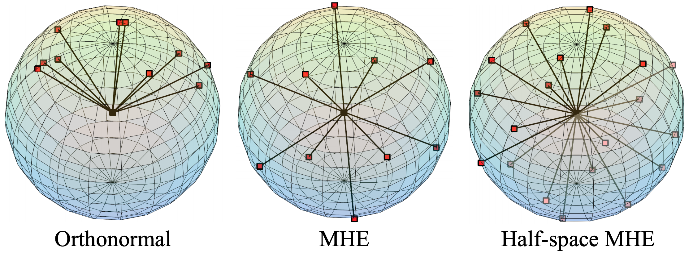
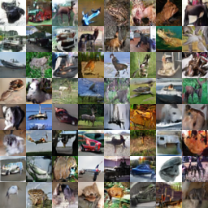

# Learning towards Minimum Hyperspherical Energy

By Weiyang Liu*, Rongmei Lin*, Zhen Liu*, Lixin Liu*, Zhiding Yu, Bo Dai, Le Song

### License
*MHE* and *SphereFace+* are released under the MIT License (refer to the LICENSE file for details).

### Contents
0. [Introduction](#introduction)
0. [Citation](#citation)
0. [Requirements](#requirements)
0. [Usage](#usage)
0. [Results](#results)
0. [SphereFace+ for face recognition](#sphereface-plus)
0. [Generative Adversarial Networks with MHE](#MHE-GAN)


### Introduction

The repository contains the tensorflow implementation of **Minimum Hyperspherical Energy (MHE)** and Caffe implementation of SphereFace+. Inspired by a well-known Physics problem (Thomson problem), MHE is formulated as an energy on a hypersphere. Minimizing it can achieve better generalization in various applications. In general, MHE serves as a simple plug-in regularization for neural networks, which enchances the neuron diversity on hyperspheres (i.e., angular diversity) and is able to consistently improve the network's generalization ability in various application. Our paper is published in **NIPS 2018** and is available at [arXiv](https://arxiv.org/abs/1805.09298).



### Citation

If you find our work useful in your research, please consider to cite:

    @article{LiuNIPS18,
      title={Learning towards Minimum Hyperspherical Energy},
      author={Liu, Weiyang and Lin, Rongmei and Liu, Zhen and Liu, Lixin and Yu, Zhiding and Dai, Bo and Song, Le},
      journal={NIPS},
      year={2018}
      }

### Requirements
1. `Python 3.6` (`Python 2.7` needs to modify the unpickle funtion in train.py)
2. `TensorFlow`
3. `Keras` (for MHE-GAN)
4. `numpy`

### Usage

#### Part 1: Clone the repositary
  - Clone the repositary.

	```Shell
	git clone https://github.com/wy1iu/MHE.git
	```
	
#### Part 2: Download CIFAR-100 training and testing data
  - For the current code, we use our own data pre-processing code, and it is the standard pre-processing for CIFAR-100. The training and testing data can be downloaded via [Google Drive](https://drive.google.com/open?id=1DA1J7tuloqyPKW-zdYEPJCipZ5HJv-5Y). Users should put the downloaded data to the `MHE_ROOT` directory.
  

#### Part 3: CIFAR-100
  - Train and test the model with the following code:

	```Shell
	cd $MHE_ROOT/code
	python train.py --model_name=mhe --power_s=0
	```
  - The parameters include `model_name: [baseline, mhe, half_mhe]` and `power_s: [0, 1, 2, a0, a1, a2]`. `mhe` denotes the full-space MHE regularization, `half_mhe` represents the half-space MHE, and `power_s` is the parameter s (see equation 1 in the paper) to control the formulation of MHE (`0,1,2` are the Euclidean distance, and `a0,a1,a2` use the angles).
  - For different datasets, you may need adjuest to hyperparameter for the entire MHE regularizaiton.
### Results
  - See the `log` folder for the expected results.
  
### SphereFace-plus

**SphereFace+** is an improved deep face recognition algorithm based on [SphereFace](https://github.com/wy1iu/sphereface). We incorporate the MHE regularization to the original SphereFace and further boost the recognition accuracy. SphereFace+ is implemented in Caffe and therefore is independently host [here](https://github.com/wy1iu/sphereface-plus).

### MHE-GAN

To train a model from scratch, simply run `python train.py`. To test the best models we provide, run `python test.py`.

For the model trained with both MHE (half-space, magnitude 1e-7) and spectral normalization (located in `MHE-GAN/sn-model`), we obtained the inception score of **7.68**, which is much higher than we originally reported in the paper. In contrast, the same GAN with only spectral normalization yields **7.4** inception score and the baseline GAN only achieves **6.64**.

For the model trained with only MHE (half-space, magnitude 1e-6, located in `MHE-GAN/non-sn-model`), we obtained the inception score of **7.48**, which is also much higher than we originally reported in the paper.

The weight files of the MHE+SN model with inception score **7.68** and the MHE-only model with inception score **7.48** are provided at [Google Drive](https://drive.google.com/open?id=1mj66LK6MRiVvNGdfASNO6v6GWW3FV3ST). Please place the model files under the `snapshots` folder in the corresponding experiment folders.

The following table summarizes the results:

| Model      | Inception Score  | Weights |
| ---------- | :-----------: | :-----------: |
| Baseline GAN | 6.64      | N/A |
| GAN w/ Spectral Norm |7.40    | N/A |
| GAN w/ MHE | **7.48**     | [Google Drive](https://drive.google.com/open?id=1mj66LK6MRiVvNGdfASNO6v6GWW3FV3ST) |
| GAN w/ Spectral Norm & MHE | **7.68**      | [Google Drive](https://drive.google.com/open?id=1mj66LK6MRiVvNGdfASNO6v6GWW3FV3ST) |

Some random samples of the generated images from MHE-GAN (MHE+SN) is shown as follows:



### Note
  - The code was tested on tensorflow of versions >= 1.10. For earlier versions, the code for computing inception score might report wrong inception scores due to bugs in tf.contrib.gan.
